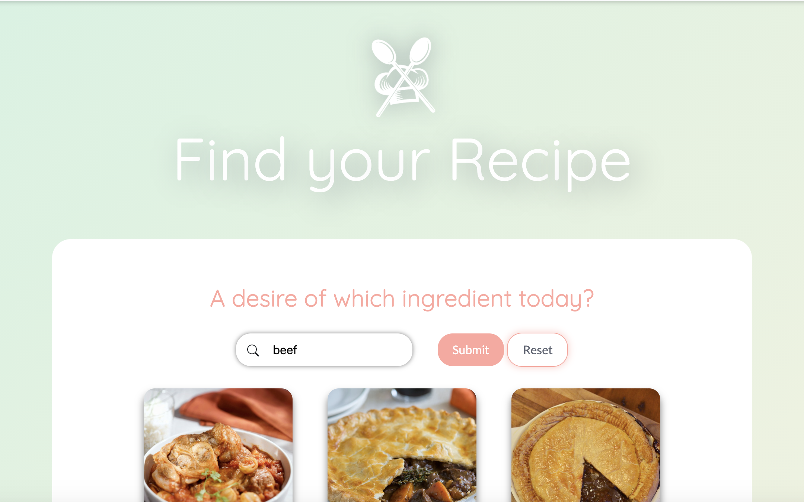

<h1>Find your Recipe</h1>

Une app pour trouver une recette selon l'ingrédient de votre choix. Il est également possible de trouver une recette de manière aléatoire. Le site a été réalisé à l'aide de l'API MealDB et des languages et technologies suivants: HTML, CSS, JavaScript et Animate.CSS. Vous pouvez consultez cette app à <a href="https://celinearn.github.io/find-your-recipe/">cette adresse</a>.

